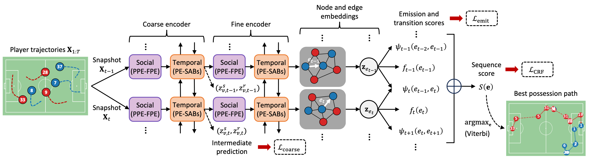
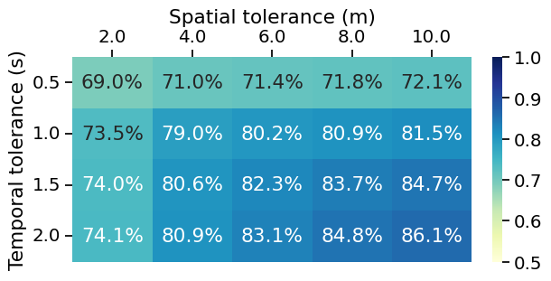
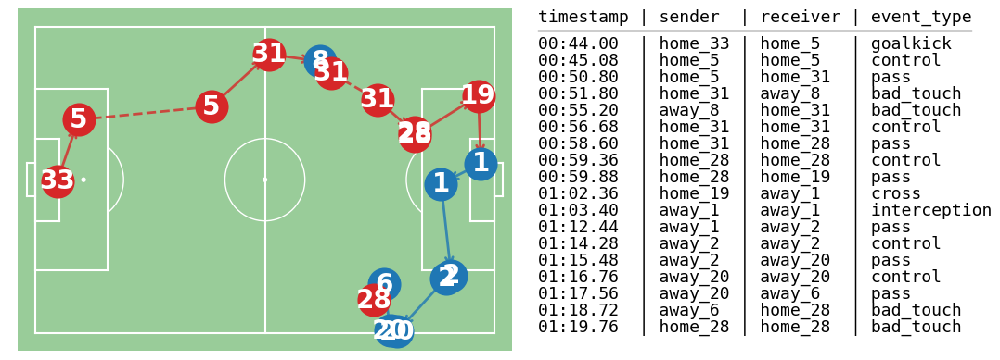
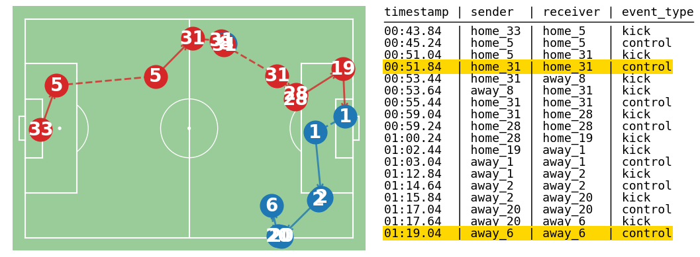
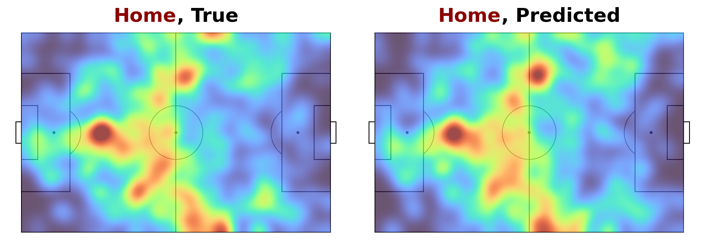
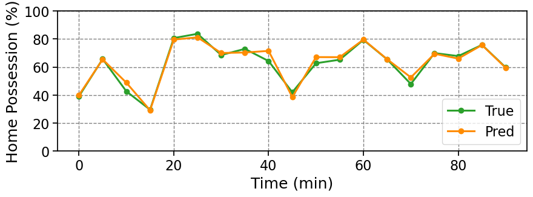
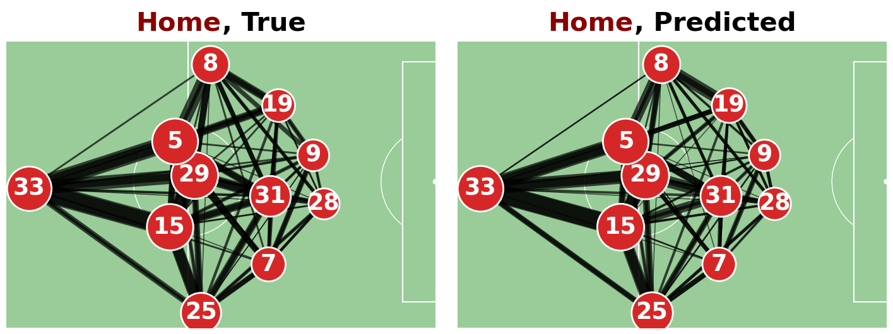

<div align="center">
	<h1>
		PathCRF
	</h1>
</div>

Source code for the paper **PathCRF: Ball-Free Sports Event Detection via Possession Path Inference from Player Trajectories**.

## Introduction
- A framework for detecting on-ball events solely from player trajectories in soccer.
<p align="center">
  
</p>

## Data Preparation and Preprocessing
- Uses [Sportec Open DFL Dataset (Bassek et al., 2025)](https://www.nature.com/articles/s41597-025-04505-y) and [kloppy](https://kloppy.pysport.org) package.
- First, to download and synchronize the event and tracking data, follow `tutorial.ipynb` of [ELASTIC (Kim et al., 2025)](https://github.com/hyunsungkim-ds/elastic.git). This will create the synchronized event and tracking data files into the designative paths.
- Place the synchronized event and tracking data files into `data/sportec/event_synced` and `data/sportec/tracking_parquet`, respectively.
- Running `python datatools/preprocess.py` merges event-based ground-truth possession into tracking data and saves the preprocessed result into `tracking_processed`. Ground-truth event data is saved in `event_rdp`.

```bash
python datatools/preprocess.py
```

## Model Training
Run the `*.sh` files in `scripts` to train models (e.g., `bash scripts/ballradar_crf.sh`).

## Model Inference and Evaluation
Follow `tutorial.ipynb` step by step to reproduce inference and evaluation.

Example outputs:
### Event recall under varying tolerance thresholds (Figure 6)


### Ground-truth and model-detected event sequences (Figure 2)



## Practical Applications
Following `tutorial.ipynb`, you can reproduce visualizations comparing the downstream analysis metrics derived from ground-truth and model-detected events.

Example outputs:
### Team-level or player-level event heatmaps (Figure 3)

  
### Timeline of the home team's possession shares (Figure 4)


### Pass networks (Figure 5)

