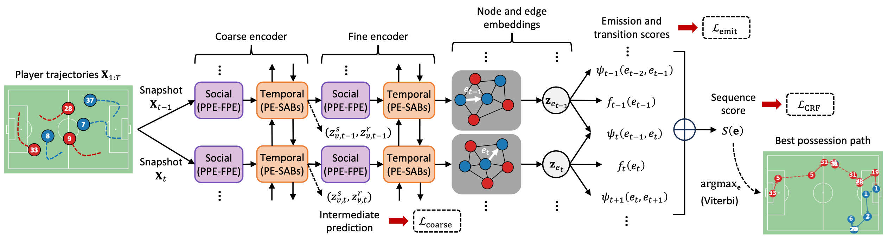
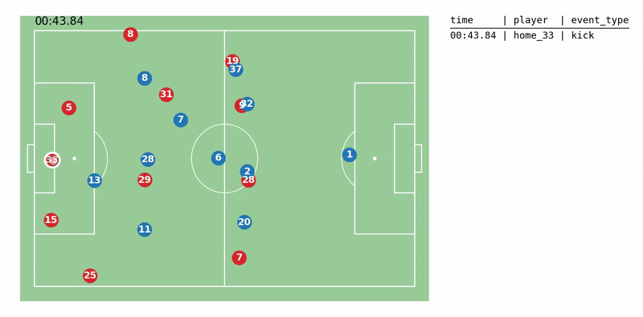
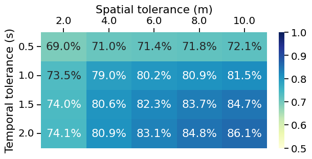
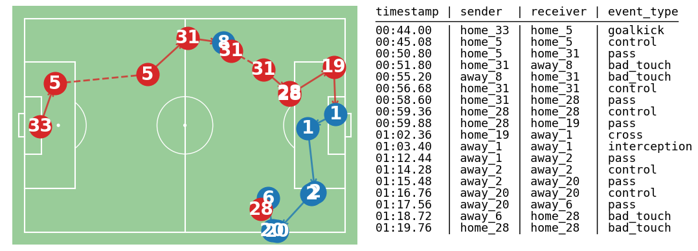
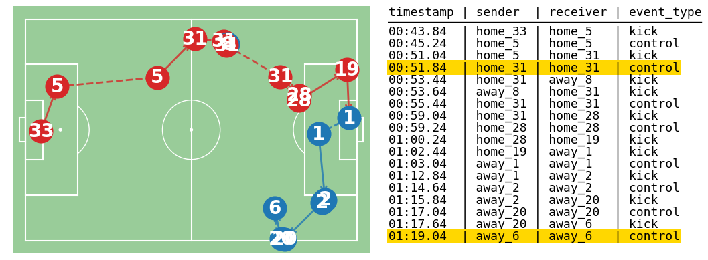
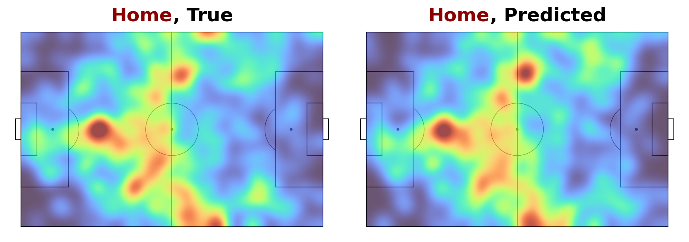
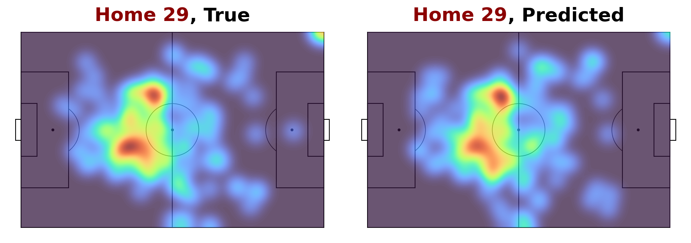
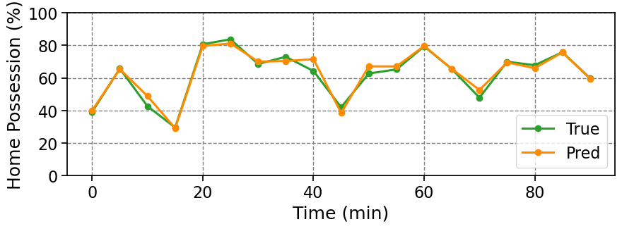
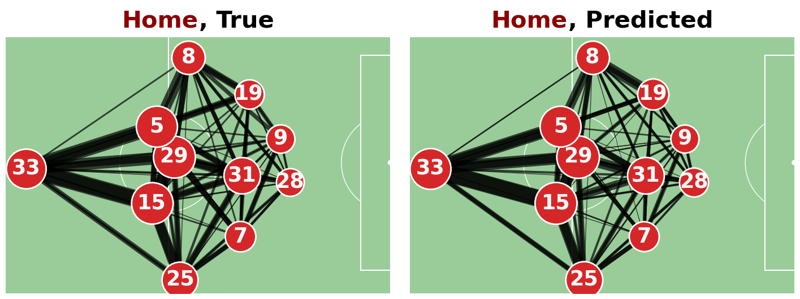

<div align="center">
	<h1>
		PathCRF
	</h1>
</div>

Official source code for the paper [PathCRF: Ball-Free Soccer Event Detection via Possession Path Inference from Player Trajectories](https://arxiv.org/abs/2602.12080) by Hyunsung Kim et al., [KDD 2026](https://kdd2026.kdd.org).

## Introduction
**PathCRF** is a framework for detecting on-ball events in soccer from player trajectories alone. It models the trajectories as a fully connected dynamic graph and formulates event detection as the problem of selecting exactly one edge corresponding to the current ball possession state at each time step. It encodes dynamic interactions between players over time via a Set Attention-based backbone, while a Conditional Random Field (CRF) enforces logical consistency across the resulting edge sequence.
<p align="center">
  
</p>

The animation below shows the PathCRF applied to an action sequence. At each moment, PathCRF predicts that either a player is in possession (highlighted), or the ball is traveling from one player to another (shown as an arrow between them). Whenever this state changes, PathCRF detects an on-ball event and logs it to the table on the right.

For reference, we overlay the actual ball trajectory as a semi-transparent path, so you can see how closely the predicted possession states track the actual ball movement, even though the framework never has access to it.
<p align="center">
  
</p>

## Data Preparation and Preprocessing
This repository uses the [Sportec Open DFL Dataset (Bassek et al., 2025)](https://www.nature.com/articles/s41597-025-04505-y) together with the [kloppy](https://kloppy.pysport.org) package. It consists of event and tracking data from seven matches of German Bundesliga's first and second divisions, and can be downloaded from [this link](https://springernature.figshare.com/articles/dataset/An_integrated_dataset_of_spatiotemporal_and_event_data_in_elite_soccer/28196177). After downloading the data, place the XML files by type in the following directories:
- Match information: `data/sportec/metadata`
- Event data: `data/sportec/event`
- Tracking data: `data/sportec/tracking`

Since the events are manually annotated and thus have imprecise timestamps, they are synchronized with the tracking data using [ELASTIC (Kim et al., 2025)](https://github.com/hyunsungkim-ds/elastic.git). For convenience, the synchronized event data is already provided in `data/sportec_synced`, so you do not need to run the synchronization yourself.

Then, run the preprocessing script below, which produces the preprocessed event data in `data/sportec/event_processed` and the tracking data combined with per-frame ground-truth possession states in `data/sportec/tracking_processed`.
```bash
python datatools/preprocess.py
```

## Model Training
For reproducibility, this repository already includes the trained models in Section 3.2:
- Non-CRF: `saved/100`
- Static Dense CRF: `saved/110`
- Static Masked CRF: `saved/120`
- Dynamic Dense CRF: `saved/130`
- Dynamic Masked CRF: `saved/140`

To train models yourself, run `*.sh` files in `scripts` (e.g., `bash scripts/ballradar_crf.sh`). Be sure to change `--trial` argument in each file to avoid overwriting existing checkpoints.

## Model Inference and Evaluation
Follow `tutorial.ipynb` step by step to run inference and evaluation.

Example outputs:
### Event recall under varying tolerance thresholds (Fig. 6)


### Ground-truth and model-detected event sequences (Fig. 2)
<p align="left">
  
  
</p>

## Practical Applications
Following `tutorial.ipynb`, you can also reproduce visualizations comparing the downstream analysis metrics derived from ground-truth and model-detected events.

Example outputs:
### Team-level and player-level event heatmaps (Fig. 3)


  
### Possession share timeline (Fig. 4)


### Pass networks (Fig. 5)


## Citation
If you use this code in your research, please consider citing our paper:
```
@inproceedings{kim2026pathcrf,
  author       = {Hyunsung Kim and
                  Kunhee Lee and
                  Sangwoo Seo and
                  Sang-Ki Ko and
                  Jinsung Yoon and
                  Chanyoung Park},
  title        = {{PathCRF}: Ball-Free Soccer Event Detection via Possession Path Inference from Player Trajectories},
  booktitle    = {Proceedings of the 32nd {ACM} {SIGKDD} Conference on Knowledge Discovery and Data Mining},
  year         = {2026},
  doi          = {10.1145/3770855.3818152},
}
```